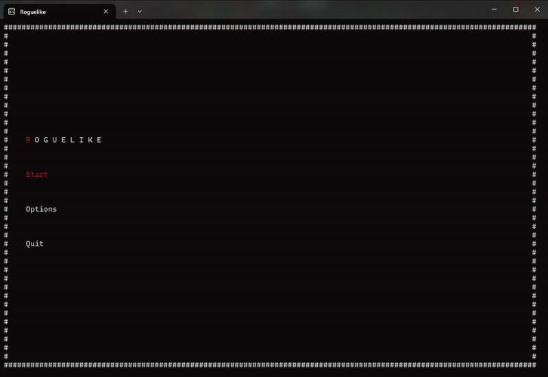
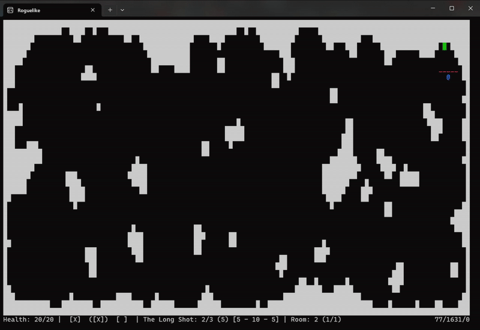

# Console Roguelike

## Introduction

This project is a 2D console-based roguelike shooter game, loosely inspired by the aesthetics of the original Rogue game.

In it, you have to push your way through waves of enemies as you get stronger with each room. Collect weapons, level your character, discover how you can use the procedurally generated, completely destructible environment to your advantage, but watch out: if you die, everything is reset and you have to start over from the beginning.

## Controls

### Menu

Use **WASD** or the **arrow keys** for menu navigation and **Enter** for confirmation. You can pause the game with the **Escape** key.

### Gameplay

Move around with the **WASD** keys and hold down **Shift** for faster movement.

Shoot in one of the four directions with **I**, **J**, **K**, **L** (like a right handed version of WASD). Reload your active weapon with **R**.

To melee, hold down **E** and then use the **IJKL** keys similarly to shooting.

You can pick up items by damaging them (either via shooting or melee), but be careful: enemies can pick them up like that too! So try to keep their fire away from valuable tiles.

To cycle through the weapons in your inventory, press **TAB**. You can drop your currently selected weapon with **V**, if you want to make space for a new gun.

## Tiles

White tiles make up the walls of the game. Except for their one-tile-wide outer layer, they are totally destructible by you and even enemies. Be careful, as enemies you think you're safe from could be digging a new line of sight on you while you're fighting somebody else.

Green tiles take you either to the next wave, or the next room. They are locked while there are active enemies in the level.

The following tiles are randomly spread around the game, to help you during and in between fights:

- Healing tiles (yellow)
- Ammo tiles (blue)
- Gun tiles (purple)
  - the type of gun it contains is randomly selected
  - try out the different guns in the game (there are quite a few) and experiment with their strength/weaknesses to find the ones that fit your playstyle

## Upgrades

After every few rooms you will be offered an upgrade. This can be in one of the following categories:

- max health
- weapon damage multiplier
- melee damage multiplier
- ammo pickup multiplier
- damage reduction

They each can be upgraded 4-5 times before you reach their penultimate state. After that, if you want to upgrade them to their final level, you have to sacrifice one level from a random other category (e.g. -10 max health for the ultimate weapon damage).

## Settings

You can change how dense you want the generated rooms to be, as well as the difficulty of the game. Most of the difficulty changes are only stats-focused (e.g. more waves per room, more enemy health, etc.), except for the _Rogue_ difficulty.

In _Rogue_ mode, healing tiles are disabled and you have to make it to the end of each room to be restored to full health. This means that you have to be able to withstand each wave of the room with a single healthbar. Thus, it's recommended to play extra safe in early waves and spec in health and damage reduction.
